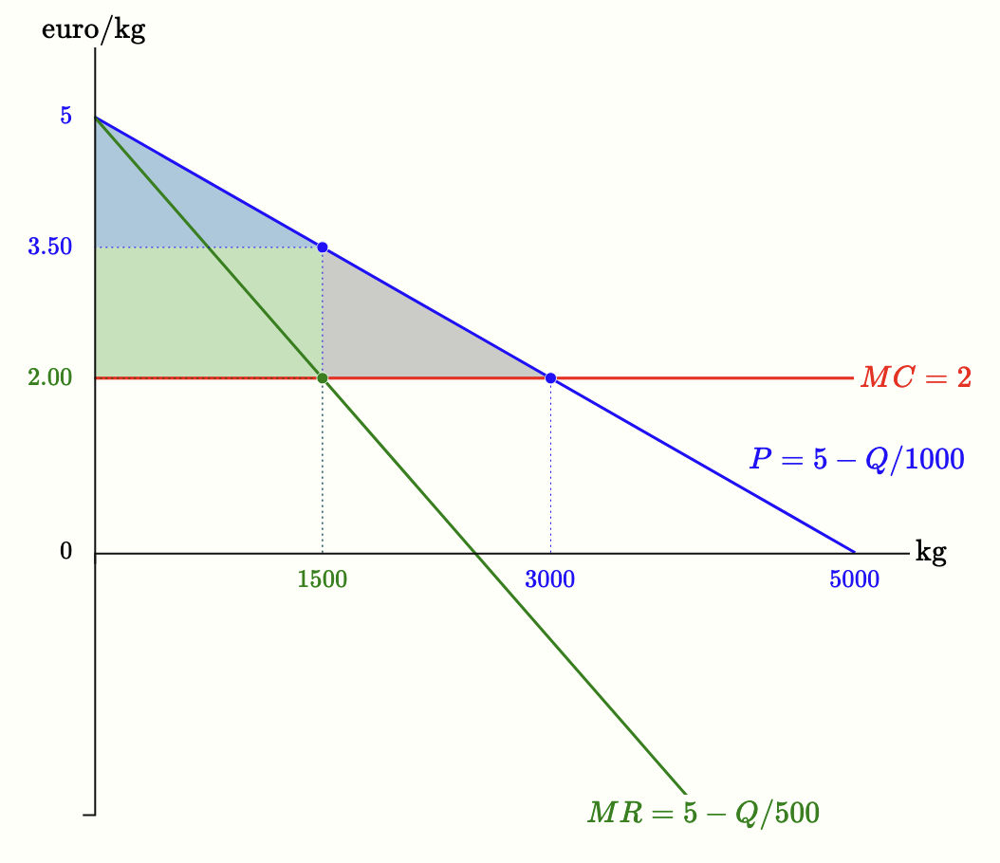

We are now ready to calculate the monopolist’s optimal choice — that is, to answer the first question posed in the previous section: how much to produce, or, equivalently, what price to choose?

As with any other firm, the monopolist’s optimal choice is determined by the condition that marginal revenue equals marginal cost. The following figure illustrates how to compute the optimal choice in the example discussed earlier: demand curve $P = 5 - Q/1000$ and marginal cost $MC = 2$.



In general, assuming a linear demand curve $P = a - bQ$, and denoting by $c$ the value of the monopolist’s marginal cost (in the example above, $c = 2$), the profit-maximizing condition $MR = MC$ becomes $a - 2bQ = c$, from which we derive the monopolist’s optimal quantity:

 \(\begin{gathered} Q = \frac{a - c}{2b} \end{gathered}\) 

Substituting this quantity into the demand curve gives the monopoly price:

 \(\begin{gathered} P = \frac{a + c}{2} \end{gathered}\) 

 

<h2 id="subsec_monopoly-dwl">Comparison with Perfect Competition</h2>
The price set by a monopolist is higher than marginal cost, unlike in perfect competition, where in the long run we have

 \(\begin{gathered} P = c \quad \text{and} \quad Q = \frac{a - c}{b} \end{gathered}\) 

Compared

to the case of perfect competition, the monopolist therefore produces a smaller quantity (half as much) and charges a higher price. This implies that total surplus is not maximized — there is a <i>monopoly deadweight loss</i>, represented by the grey triangle in Figure 5.5 (reproduced here on the side). In that example, the monopolist produces $1500$ units and charges a price of 3.50 euros. If output were increased, the price would have to be lowered even on units already sold, and profit (the green area) would shrink. For this reason, the quantity produced is below the socially efficient level — the competitive quantity, equal to $3000$ units.

In the introduction we saw an initial illustration of the principle that whenever total surplus in a market is not maximized, one can imagine an alternative allocation that would be unanimously preferred. That is exactly what happens here. How could <i>everyone</i> — monopolist and consumers — be made better off? If output rose from $1500$ to $3000$ units and the price fell from 3.50 to 2.00 euros, consumer surplus would grow by the green area plus the grey area (3375 euros), while the monopolist would lose the green area (2250). But this means that consumers would be willing to “buy” this change from the monopolist at a price higher than the amount for which the monopolist would be willing to “sell” it. By offering the monopolist a transfer between 2250 and 3375, the monopolist would receive more than he loses and consumers would still obtain a net gain.

In practice, consumers do not have a collective organization. There are consumer protection associations such as <a href="https://www.altroconsumo.it" target="_blank">Altroconsumo</a> in Italy or <a href="https://www.beuc.eu" target="_blank">BEUC</a> at the European level, but they cannot organize collective transfers on this scale.

The inefficiency therefore does not arise from a mistake by the monopolist, who rationally maximizes his own profit, but from the fact that such an agreement cannot be carried out. Coordinating millions of consumers so that they all sit at the same table and each contribute their share is simply impossible. It is precisely this lack of coordination on the demand side that makes the agreement impracticable and leaves the deadweight loss of welfare intact.

 

<h2 id="subsec_monopoly-markup">Monopolist's Markup</h2>

One of the most important implications of monopolistic behavior concerns the <b>markup</b>, or  <b>Lerner index</b>, defined as the difference between price and marginal cost relative to price:

 \(\begin{gathered} \frac{P - MC}{P} \end{gathered}\) 

It is easy to show that the monopolist’s markup equals the negative inverse of the price elasticity of demand:

 \(\begin{gathered} \frac{P - MC}{P} = -\frac{1}{E^D} \end{gathered}\) 

where $E^D$ is the price elasticity of demand at the optimal choice. In fact, at the optimum we have $MR = MC$, and we have also seen that $MR = P(1 + 1/E^D)$. Combining these two results immediately yields the conclusion.

If demand

The Lerner index can be used to measure a firm’s market power even without knowing its costs. If the price elasticity of demand can be estimated empirically, it is possible to infer the markup the firm is applying.

is highly elastic, the markup is low: the monopolist cannot raise the price much without losing a large number of sales. If demand is inelastic, the markup is high: the monopolist can increase the price without significantly reducing the quantity sold. This helps explain why prices are often high in markets where consumers have few alternatives or cannot forgo the purchase (and conversely, why prices are lower in markets with, for example, strong competition from similar products).